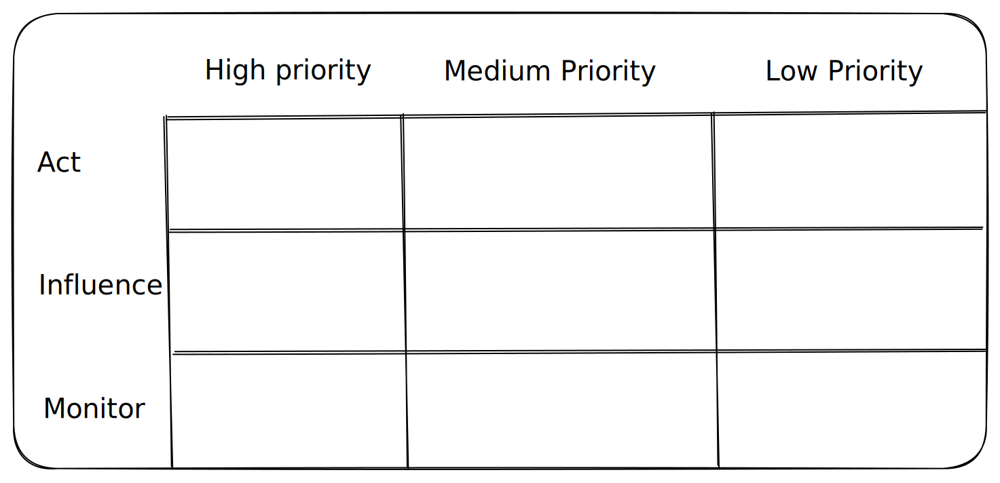

# 👩💻 Development

The development phase consists of the early stages of algorithmic development \[needs edit]. Whereas moral reflection should take place throughout the entire algorithmic pipeline, it is particularly important that researchers, practitioners, and developers reflect early on about the consequences of the algorithm or technology that is intended to be developed. Organizations may facilitate such reflection by hosting an event following the instructions below, which are inspired by the Consequence Scanning. Such event should be inclusive and representative of the organization. The event should be designed according to the structure and needs of the team working on the development. Upon completion of the event, main findings should be reported and strategies should be developed to assign responsibilities.

### :thinking::hourglass:Reflection

#### Participants should reflect on the following questions:

What are the positive consequences of the algorithm?

What are the negative consequences of the algorithm?

***

### :scroll::speaking\_head:Affinity Sorting

Participants write their reflections and proceed with a short debate in which they group similar ideas together.

***

### :hourglass\_flowing\_sand::writing\_hand:Quiet Time

Participants have another opportunity to reflect and write down additional consequences.

***

### :speech\_balloon::chart\_with\_upwards\_trend:Action Sorting

Participants organize discovered consequences in the following grid:


:point\_right: Act: Consequences that can be acted upon immediately.

:point\_right: Influence: Consequences that need to be handled by other stakeholders, either within the organization or externally, but within reachable networks.

:point\_right: Monitor: Consequences that cannot be controlled, such as political climate or global trends.


***

### :speech\_balloon::busts\_in\_silhouette:Discussion

The team should finalize the event log by discussing the sorted actions, developing strategies, and assigning responsibilities.

***

### :open\_file\_folder:Shared Repository

The team should keep the Action Sorting Table and other notes in a shared repository that can be updated throughout the project.
